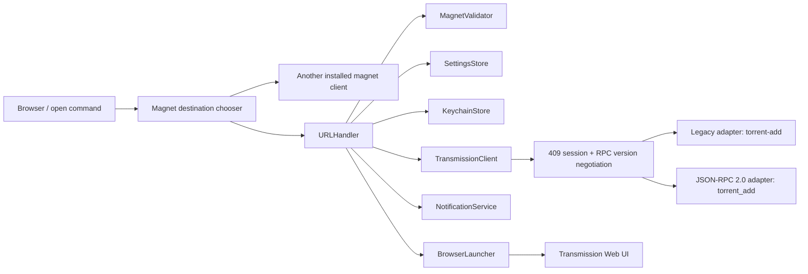

# Architecture

MagnetBridge has a compact SwiftUI macOS application target, an embedded
optional CLI mode, and a UI-independent `MagnetBridgeCore` target. `AppModel`
owns graphical state and asynchronous actions; networking and business rules
remain outside SwiftUI.

## Request flow

`URLHandler` orchestrates one incoming link. `MagnetValidator` enforces scheme,
size, and `btih`/`btmh` exact-topic rules. `SettingsStore` persists one profile
without credentials; `KeychainStore` owns the password.

The same signed executable has two entry paths. With CLI arguments it runs a
command and exits. Without arguments it starts the GUI. It may run as a menu bar
accessory or as a regular Dock application according to the saved preference.
When LaunchServices delivers a `magnet:` Apple Event, the app shows its window
and offers the configured server plus other installed handlers discovered with
`NSWorkspace`. Selecting another client uses `NSWorkspace` directly and never a
shell command.

`TransmissionClient` is an actor. It sends requests through the injectable
`NetworkSession` interface and caches the CSRF session ID for its lifetime. On
HTTP 409 it reads `X-Transmission-Session-Id` and
`X-Transmission-Rpc-Version`. RPC semantic version 6 or later selects JSON-RPC
2.0; older or absent version headers select the legacy adapter.

The two adapters own wire-format differences:

| Transmission | Envelope | Add method | Parameter style |
| --- | --- | --- | --- |
| 4.0.x | Transmission legacy RPC | `torrent-add` | kebab/camel case |
| 4.1+ | JSON-RPC 2.0 | `torrent_add` | snake case |

Core errors distinguish invalid input, authentication, timeout, unavailable
server, HTTP server errors, RPC errors, and malformed responses. A duplicate is
a successful `TorrentAddOutcome`, never an error.

## Data boundaries

The complete magnet URL exists only in the incoming event, the in-memory
destination choice, the in-memory retry state, and the outbound RPC body. It is
not persisted or logged. The password crosses only the Keychain boundary and
the transient HTTP Authorization header.
Diagnostics contain hostnames, not URL paths, query strings, credentials, or
magnet payloads.

`BrowserLauncher` uses `NSWorkspace`, never shell commands. If the selected
bundle identifier is no longer installed, it opens the system browser and
reports a fallback.
